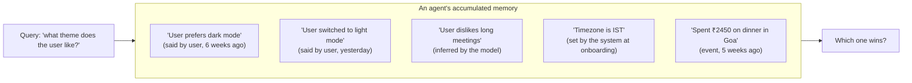
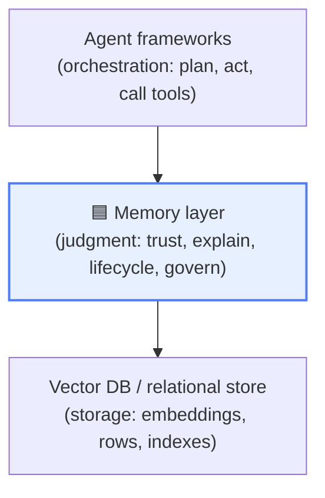

# Why AI Agents Need a Memory Layer, Not a Bigger Vector Index

Your agent confidently books a table at the restaurant your user told it — *yesterday* —
that they never want to go back to. The preference was in the database. The agent retrieved
something else. Nothing crashed. The system "worked." And it was wrong.

This is the failure mode nobody demos. It doesn't show up in a benchmark of retrieval
accuracy, because the memory *was* retrievable. It shows up in production, three weeks into a
long-lived agent's life, when the accumulated pile of facts, preferences, and events starts
to contradict itself — and the storage layer underneath has no opinion about which version
to believe.

We shipped statelessness first because it was easy: prompt in, completion out, no history to
manage. But the entire industry is now moving toward **long-lived agents** — assistants,
copilots, and autonomous workers that persist for weeks and accumulate memory the whole
time. And the default answer to "how should they remember?" — *"just add a vector
database"* — is quietly, structurally insufficient.

This post is the argument for why. The rest of the series builds the alternative, an
open-source **trust-aware, explainable memory layer** called
[SCP Memory Engine](https://github.com/your/scp-memory-core).

## The shape of the problem

Here's what a long-lived agent's memory actually looks like after a month:



A vector database answers *"which memory is most semantically similar to the query?"* — and
for the theme question, both the dark-mode and light-mode memories match. It returns the
nearest one. It has **no way to know** that:

- B *contradicts* A and is more recent (the user changed their mind),
- C was *inferred* by a model and deserves less weight than something the user *said*,
- D came from the *system*, not the user, and
- E is an *event* that has mostly stopped mattering, while a *preference* like A/B persists.

Those are not retrieval problems. They're **judgment** problems. And judgment is exactly what
a vector index — by design — does not have.

## The three things a vector store can't do

### 1. It can't tell you *who said it* (no provenance, no trust)

Every memory in a vector store is equal: a point in embedding space. But a fact the user
stated explicitly is not equal to a guess your model made at 2 a.m. A preference confirmed
twice this week is not equal to one mentioned once, months ago, and contradicted since.

Humans reason about memory with **provenance** ("where did I learn this?") and **confidence**
("how sure am I?") constantly. Strip those away and you get an agent that treats its own
hallucinations with the same authority as the user's direct instructions. That's not a tuning
problem you fix with a better embedding model. The information was never stored.

### 2. It can't tell you *why* a memory surfaced (no explanation)

Top-k cosine similarity is a black box with a number on it. When your agent makes a
consequential decision based on a retrieved memory and a human asks *"why did it think
that?"*, the honest answer is *"a dot product was high."* That's unacceptable the moment the
decision matters — a financial action, a medical reminder, anything auditable.

You cannot debug what you cannot explain. And you cannot ship into a regulated workflow a
memory system whose answer to "why" is a shrug.

### 3. It can't manage the memory over time (no lifecycle, no governance)

Real memory has a lifecycle. It gets **consolidated** (ten related notes become one summary).
It **decays** (last Tuesday's lunch stops being relevant; your home timezone doesn't).
Duplicates get **merged**. Importance shifts. A vector store does none of this — it's a
write-once bucket that grows monotonically until retrieval quality drowns in stale near-
duplicates.

And it has no **governance**: no namespacing to keep tenants apart, no audit trail of what
the agent knew and when, no governed deletion when a user exercises their right to be
forgotten. These aren't enterprise nice-to-haves. They're the difference between a demo and
a product that touches a real person's data.

## "Memory" is the wrong abstraction level for a vector DB

Here's the reframe. A vector database is **storage** — a brilliant index for
nearest-neighbor search. An agent framework is **orchestration** — it decides what to do.
Between them sits a layer that almost nobody has built as shared infrastructure:



The memory layer's job is not to store embeddings faster. It's to apply **judgment to stored
information**: attach provenance, detect corroboration and contradiction, model freshness,
explain every result, run the lifecycle, and enforce governance. Storage is a dependency of
this layer, not a replacement for it.

This is the same evolution web systems went through. We didn't keep writing raw files to
disk; we built databases with transactions, constraints, and query planners — *judgment about
stored data*. Agent memory is at the "raw files to disk" stage right now. The vector DB is the
disk. The database hasn't been standardized yet.

## What the layer looks like in practice

Concretely, here's the difference at the API boundary. A vector store returns this:

```json
[ { "id": "abc", "score": 0.82, "text": "User prefers dark mode" } ]
```

A trust-aware memory layer returns this:

```json
{
  "memory": { "id": "mem_…", "type": "preference", "content": "User switched to light mode" },
  "score": 0.79,
  "signals": { "keyword": 0.3, "vector": 0.74, "metadata": 1.0, "importance": 0.58, "trust": 0.71 },
  "weights": { "keyword": 0.3, "vector": 0.3, "metadata": 0.1, "importance": 0.1, "trust": 0.2 },
  "trust": {
    "provenance_quality": 1.0,
    "confidence": 0.78,
    "freshness": 0.95,
    "explanation": "User-stated preference; recent; contradicts an earlier 'dark mode' memory."
  }
}
```

The second response *ranks the recent, contradicting memory appropriately*, tells you the
per-signal contributions behind that rank, and explains the trust verdict in a sentence a
human can read. The agent — and an auditor — can now answer both "what" and "why," and "how
much should I rely on this?"

That `trust` block isn't a model output you have to take on faith. It's **decomposable**:
provenance × confidence × freshness, each computed transparently. The next post in this
series builds it.

## "But can't I just add metadata / recency to my vector DB?"

You can bolt on a `created_at` and sort by it. You can add a `source` field. People do. But
you end up reimplementing — ad hoc, per project, untested — exactly the layer this post is
arguing for: contradiction detection, type-aware decay (an event and a preference should not
age at the same rate), corroboration that raises confidence, an explanation contract, audit,
namespacing, and a lifecycle. The question isn't whether you need these. It's whether you
build them once, as infrastructure, with tests and a stable contract — or fifteen times, as
glue, in fifteen agents.

The bet behind SCP Memory Engine is that this is **shared infrastructure**, the same way a
database is. Build it once, well, with an explainability contract and a trust model you can
calibrate, and let every agent stand on it.

## The honest caveats

- **Vector search is still in here.** This isn't "vector DBs are bad." Hybrid retrieval
  *uses* vectors — alongside keyword and metadata signals. The argument is about the *layer*,
  not the index.
- **Trust is a signal, not truth.** A trust score of 0.4 doesn't mean "false." It means "rely
  on this less." The layer's job is to surface judgment, not to adjudicate reality.
- **This adds latency and payload.** Carrying signals and computing trust isn't free. The
  series covers how to keep it bounded — but if your agent is stateless and short-lived, you
  may genuinely not need this. The case is for *long-lived* agents.

## Where this series goes

Over the next six posts we'll build the layer piece by piece:

2. **Trust as a first-class signal** — provenance × confidence × freshness, decomposable.
3. **Explainable hybrid retrieval** — keyword ∪ vector ∪ metadata you can actually debug.
4. **Memory lifecycle** — importance, dedup, consolidation, decay.
5. **Calibrate before you sophisticate** — why a "smarter" model can make trust *worse*.
6. **Hermetic by default, pluggable at scale** — one codebase from laptop to cluster.
7. **Governing agent memory** — namespacing, audit, and the right to be forgotten.

## Try it in 60 seconds

```bash
git clone https://github.com/your/scp-memory-core && cd scp-memory-core
pip install -e ".[dev]"
python -m scp_memory &                       # engine on :8000
python seed/seed_golden_examples.py          # 10 memories that each show one capability
```

Then ask it *"what theme does the user like?"* and watch a trust-scored, explained answer
come back — including the fact that the user changed their mind.

If the idea that **memory is infrastructure, not a bigger index** resonates, ⭐ the repo and
read [Post 2: Designing Trust as a First-Class Signal](02-trust-as-a-first-class-signal.md).
Statelessness was a phase. What comes next needs to remember — and to know what it remembers
is worth believing.
