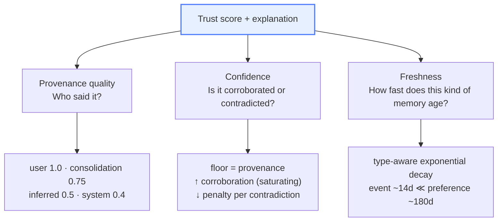
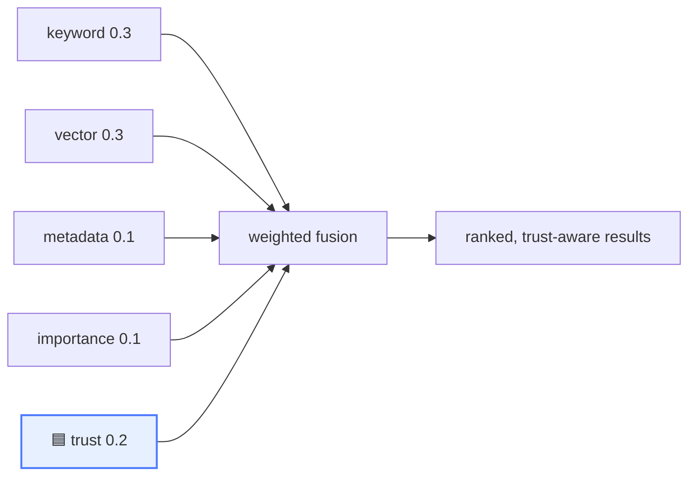

# Designing Trust as a First-Class Signal in Agent Memory

In [Post 1](01-why-agents-need-a-memory-layer.md) I argued that a long-lived agent needs
*judgment* about what it remembers, and that a vector index has none. This post builds the
core of that judgment: a **trust score** that answers "how much should I rely on this
memory?" — and does it transparently enough that a human can audit the answer.

The temptation is to train a model that takes a memory and emits a trust score. Resist it.
A learned scalar you can't explain is exactly the black box we're trying to escape. Instead,
we'll **decompose** trust into three sub-scores that each mean something, combine them with
simple, inspectable rules, and attach a sentence of explanation to every verdict.

## The model: trust = provenance × confidence × freshness

Three questions, three sub-scores:



Each factor is independently computable and independently meaningful. Let's take them one at
a time.

### Provenance: who said it?

The single most important thing a vector store throws away is the *source* of a memory. We
map source to a base quality:

| Source | Quality | Meaning |
|---|---|---|
| `user` | **1.0** | The user stated it explicitly. Highest authority. |
| `consolidation` | **0.75** | The system summarized it from other memories. |
| `inferred` | **0.5** | A model guessed it. Useful, but treat with care. |
| `system` | **0.4** | A default or system process set it. Lowest authority. |
| *(unknown)* | 0.5 | Neutral fallback. |

```python
_PROVENANCE_QUALITY = {
    "user": 1.0,
    "consolidation": 0.75,
    "inferred": 0.5,
    "system": 0.4,
}

def provenance_quality(source: str | None) -> float:
    return _PROVENANCE_QUALITY.get(source or "", 0.5)
```

That's the whole thing. No model, no magic — a lookup that encodes a policy you can read,
argue with, and change. The point of decomposition is that *this table is a debate you can
have*, not a weight buried in a network.

### Confidence: is it corroborated or contradicted?

Provenance gives a floor. **Confidence** raises or lowers it based on what *other* memories
say. Two mechanisms:

- **Corroboration** — other memories agree. Each one nudges confidence up, but with
  *diminishing returns* (the tenth corroboration matters less than the first), so it
  saturates toward 1.0 rather than blowing past it.
- **Contradiction** — another memory disagrees. Each applies a fixed penalty. A recent,
  user-stated contradiction is how "I changed my mind" gets represented numerically.

```python
def confidence(prov_quality: float, corroborations: int, contradictions: int) -> float:
    # Start at the provenance floor.
    c = prov_quality
    # Corroboration saturates: each one closes part of the remaining gap to 1.0.
    for _ in range(corroborations):
        c += (1.0 - c) * 0.6
    # Contradictions apply a fixed penalty each.
    c -= contradictions * 0.15
    return max(0.0, min(1.0, c))
```

The saturating corroboration (`c += (1 - c) * 0.6`) is worth pausing on: it means confidence
*approaches* certainty asymptotically and never reaches a false 1.0 from sheer repetition.
Ten weak echoes shouldn't equal one direct confirmation — and here they don't.

### Freshness: how fast does this kind of memory age?

Not all memories decay at the same rate, and *the type tells you the rate*. "I ate lunch at
noon" is stale by dinner. "My timezone is IST" is good for years. So freshness is a
**type-aware** exponential decay:

```python
import math

_HALF_LIFE_DAYS = {
    "event": 14,        # events age fast
    "preference": 180,  # preferences persist
    "fact": 365,        # facts persist longer
    "summary": 120,
}

def freshness(memory_type: str, age_days: float) -> float:
    half_life = _HALF_LIFE_DAYS.get(memory_type, 180)
    return 0.5 ** (age_days / half_life)
```

A 35-day-old `event` has freshness `0.5 ** (35/14) ≈ 0.18` — it's mostly faded. A 35-day-old
`preference` is `0.5 ** (35/180) ≈ 0.87` — still very much alive. Same age, very different
relevance, because the *kind* of memory differs. This single idea fixes a huge class of
"why did it surface that ancient thing?" bugs.

## Combining — and explaining

The sub-scores combine into an overall trust verdict, but the part that matters for adoption
is that we emit an **explanation** alongside it:

```json
{
  "provenance_quality": 1.0,
  "confidence": 0.78,
  "freshness": 0.95,
  "score": 0.84,
  "explanation": "User-stated preference (high provenance), recent, contradicts an earlier 'dark mode' memory."
}
```

That sentence is generated from the same inputs that produced the numbers — it's not a
separate model's gloss. Provenance was `user` → "high provenance." There was one
contradiction → "contradicts an earlier memory." Age was small relative to the preference
half-life → "recent." **The explanation is a view of the computation, so it can never drift
from it.** That property is why we treat explanation as a contract, not a feature (more in
[Post 3](03-explainable-hybrid-retrieval.md)).

## Trust as the 4th ranking dimension

Here's the move that makes trust *useful* rather than decorative: it doesn't just annotate
results, it **ranks** them. In hybrid retrieval, the final score fuses keyword, vector, and
metadata signals — and trust enters as a first-class dimension with its own weight:



This is how the "I changed my mind" case resolves correctly: the recent light-mode memory and
the old dark-mode memory have similar semantic scores, but the recent one wins on freshness
(inside trust) and the old one is *penalized* for being contradicted. The agent surfaces the
right answer not because the embedding was better, but because the **memory layer had an
opinion about which to believe.**

## See it run

```bash
python -m scp_memory &
python seed/seed_golden_examples.py
curl localhost:8000/v1/trust/<a-memory-id>
```

You'll get the decomposed breakdown for any memory. Try it on the system-sourced timezone
memory (provenance 0.4) versus a user-stated preference (1.0) and watch the floor move.

## The honest caveats

- **Corroboration/contradiction detection is the hard part.** In the hermetic default, "do
  these two memories agree or disagree?" is a *lexical* heuristic (same-type neighbors,
  token overlap, negation polarity). It's good enough to demo the mechanics and wrong on
  semantic contradictions it can't read lexically (e.g. "Berlin" vs "Munich"). A real NLI
  model does better — but only adopt it if it's *better calibrated*, which is the entire
  subject of [Post 5](05-calibrate-before-you-sophisticate.md).
- **The constants are policy, not physics.** 0.6 saturation, 0.15 penalty, the half-lives —
  these are defaults you should tune to your domain. The win is that they're *explicit and in
  one place*, not implicit and everywhere.
- **Trust is a signal, not a verdict on reality.** Low trust means "weight this less," not
  "this is false." Keep that distinction in your UI and your prompts.

## Why decomposition beats a learned score

A reviewer once asked me, "wouldn't a trained model be more accurate?" Maybe — on some metric,
on some dataset. But three properties of the decomposed design are non-negotiable for
infrastructure:

1. **You can explain every score** to a user or an auditor, in a sentence, truthfully.
2. **You can unit-test each factor** in isolation (and we do — provenance, confidence, and
   freshness each have their own tests, all pure functions with no I/O).
3. **You can change policy** without retraining anything — edit a table, re-run the tests.

A black box trades those away for a number you can't defend. For a memory layer that wants to
ship into auditable, human-in-the-loop systems, that's a bad trade.

## Next

We've made trust computable and explainable. Next we wire it into retrieval so *every result*
carries its signals and its trust — and you can debug a bad result by reading, not guessing.

➡️ [Post 3: Explainable Hybrid Retrieval You Can Actually Debug](03-explainable-hybrid-retrieval.md)

Code for everything above is in [`trust/`](https://github.com/your/scp-memory-core) —
`provenance.py`, `confidence.py`, `freshness.py`, `explain.py`, all pure and tested. ⭐ if a
trust model you can *read* is the kind of thing you've wanted in your stack.
