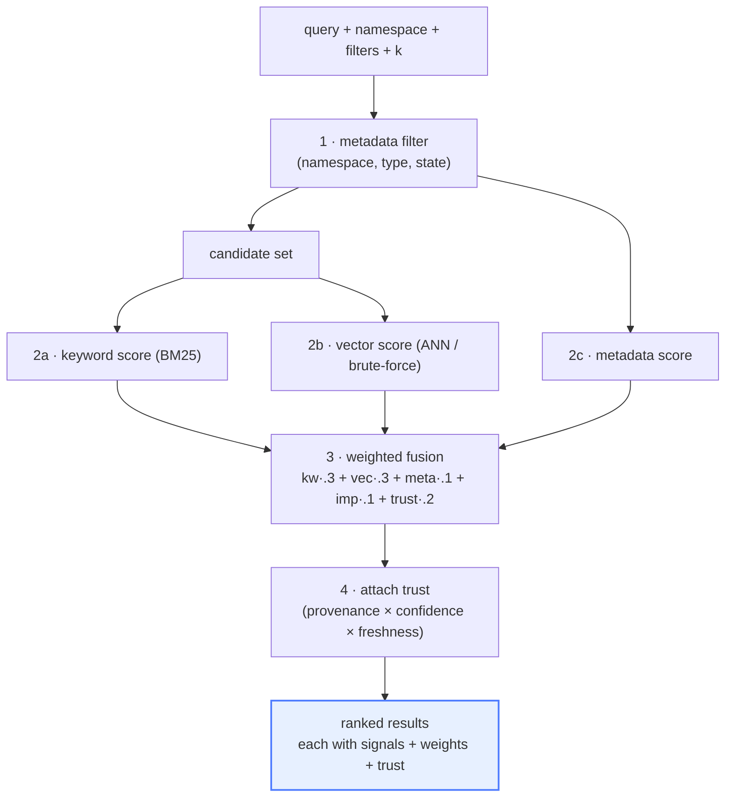

# Explainable Hybrid Retrieval You Can Actually Debug

Every RAG engineer has had this conversation: "the agent surfaced the wrong document." "Why?"
"...the vector similarity was high, I guess." That's where the debugging *ends*, because a
single cosine score is the only thing the retriever told you. You're left re-embedding queries
by hand and squinting at a t-SNE plot.

This post is about a retrieval pipeline where that conversation goes differently — where
"why did this surface?" has a *literal answer attached to the result*. We'll build hybrid
retrieval (keyword ∪ vector ∪ metadata) with **explainability as a contract**: every result
carries its per-signal scores, the fusion weights, and a trust breakdown. This is part 3 of a
series building a trust-aware memory layer; [Post 2](02-trust-as-a-first-class-signal.md) built
the trust signal we're about to fuse in.

## Why hybrid, not just vector

Vector search is great at *semantic* similarity and bad at *exact* matches. Ask for "invoice
DEL-GOI-14A" and an embedding model will happily return semantically-flighty neighbors while
missing the exact token. Keyword search (BM25) is the opposite: precise on tokens, blind to
meaning. Metadata filters are precise on structure ("type = event, category = travel") and
say nothing about relevance.

You want all three. Hybrid retrieval runs them together and **fuses** the scores:



The order matters: **filter first** (cheap, shrinks the candidate set), score the survivors on
each signal, fuse, then attach trust. Each stage is a pure function of its inputs, which is what
makes the whole thing testable and explainable.

## The contract: every result explains itself

Here's the response shape. The thing to notice is that `signals`, `weights`, and `trust` are
**not optional** — they're always present, on every result:

```json
{
  "memory": { "id": "mem_…", "type": "event", "content": "Flight Delhi to Goa, seat 14A, 8200 rupees" },
  "score": 0.71,
  "signals":  { "keyword": 0.62, "vector": 0.55, "metadata": 1.0, "importance": 0.66, "trust": 0.74 },
  "weights":  { "keyword": 0.3,  "vector": 0.3,  "metadata": 0.1, "importance": 0.1, "trust": 0.2 },
  "trust":    { "provenance_quality": 1.0, "confidence": 0.74, "freshness": 0.21,
                "explanation": "User-recorded event; 40 days old so freshness has decayed." }
}
```

Now the "why did this surface?" conversation has an answer: the metadata matched perfectly
(`metadata: 1.0`), keyword carried it (`0.62` — the exact tokens "Delhi", "Goa", "14A"
matched), but freshness was low (`0.21` — it's a 40-day-old event), which is *why it ranked
where it did and not higher*. You read that off the result. No re-embedding, no guessing.

The final score is just the dot product of `signals` and `weights`:

```python
def fuse(signals: dict[str, float], weights: dict[str, float]) -> float:
    return sum(signals[k] * weights[k] for k in weights)
```

That's deliberately boring. Boring is debuggable. When a result ranks surprisingly, you can
compute the contribution of each term by hand and find the culprit in seconds.

## Why "explainability as a contract" and not "an explain endpoint"

A tempting design is to make explanation a *separate* call: retrieve normally, then ask
`/explain?id=…` if you care. We rejected that (it's [ADR-02](https://github.com/your/scp-memory-core)
in the repo). Two reasons:

1. **A second endpoint can drift from the first.** If "explain" recomputes scores, it can
   disagree with the ranking it's supposed to explain. The only way to guarantee the
   explanation matches the rank is to emit it *from the same computation*, inline.
2. **"Why" is not a luxury feature for a memory layer — it's the product.** The whole thesis
   of this series is that judgment must be inspectable. Hiding it behind an opt-in call
   signals it's optional. It isn't.

The cost is real: bigger payloads, stricter response typing. We pay it. In exchange, *every
client* — the SDK, the admin console, your agent — can render "why" unconditionally, and the
contract is stable.

## Fusion: weighted vs RRF (and why we benchmarked it)

There are two common ways to combine ranked signals: **weighted** (multiply each normalized
signal by a weight and sum — what's shown above) and **Reciprocal Rank Fusion** (combine by
rank position, ignoring raw scores). RRF is popular because it's robust to signals on
different scales.

We support both — but the default is *weighted*, and not because it's prettier. We
**benchmarked** it on a fixed labelled set and weighted won decisively (nDCG ≈ 1.00 vs ≈ 0.69
on our eval set), partly because weighted lets **trust enter ranking as a tunable dimension**
with its own weight, where RRF would flatten it into a rank position. The lesson:

> Don't pick a fusion strategy from a blog post (including this one). Pick it from *your*
> eval set. We made RRF a one-line switch precisely so you can re-run the comparison on your
> data.

```python
# the strategy is a parameter, not a hardcoded choice
results = retrieval_service.search(query, namespace, fuse_method="weighted")  # or "rrf"
```

[Post 5](05-calibrate-before-you-sophisticate.md) generalizes this discipline: *measure before
you adopt.*

## Debugging a real bad result

Say your agent surfaced a stale event over a relevant preference. With this contract, you pull
the two results and diff their `signals`:

```text
event  (surfaced):   keyword 0.62  vector 0.55  metadata 1.0  trust 0.21   → score 0.61
pref   (wanted):     keyword 0.20  vector 0.71  metadata 0.0  trust 0.92   → score 0.49
```

Instantly visible: the event won on **metadata** (1.0 vs 0.0 — your filter or tags favored it)
and keyword, despite the preference being far more trustworthy (0.92 vs 0.21). The fix isn't
"train a better embedder" — it's "your metadata weight is too high for this query class" or
"add the preference's tags." **You debugged a ranking by reading numbers, not re-running
experiments.** That's the entire point.

## See it run

```bash
python -m scp_memory &
python seed/seed_golden_examples.py
curl -X POST localhost:8000/v1/retrieval/search -H 'Content-Type: application/json' \
  -d '{"query":"how much did I spend in Goa?","namespace":"demo:golden","k":5}'
```

You'll get the dinner (₹2450) and flight (₹8200) memories, each with its full `signals` /
`weights` / `trust` block. Or open the **admin console's Retrieval Inspector**, where every
signal is a labeled score bar — the visual version of this contract.

## The honest caveats

- **Default embeddings are a hermetic stand-in.** The out-of-the-box embedder is a
  deterministic hashing function so the repo runs offline with no model download. Its
  *semantic* quality is limited — real semantics come from an opt-in sentence-transformers
  model ([Post 6](06-hermetic-by-default-pluggable-at-scale.md)). The *pipeline and the
  explainability contract* are identical either way; only the vector signal's quality changes.
- **Weights are a tuning surface, not a universal truth.** The defaults (kw .3 / vec .3 /
  meta .1 / imp .1 / trust .2) are a starting point. Tune them on your eval set.
- **Explainability costs payload and latency.** Bounded `k` and per-stage spans (we trace
  candidates/vector/keyword/trust/fuse separately) keep it in check, but it's not free.

## Next

We can now retrieve and explain. But retrieval quality quietly rots if memory just piles up
forever. Next: the **lifecycle** — importance, deduplication, consolidation, and decay — that
keeps the store from drowning in stale near-duplicates.

➡️ [Post 4: Memory Has a Lifecycle](04-memory-lifecycle.md)

The pipeline lives in [`retrieval/`](https://github.com/your/scp-memory-core) (`keyword.py`,
`embedding.py`, `fusion.py`) — all pure, all tested. ⭐ if "debuggable retrieval" sounds like
something your RAG stack is missing.
