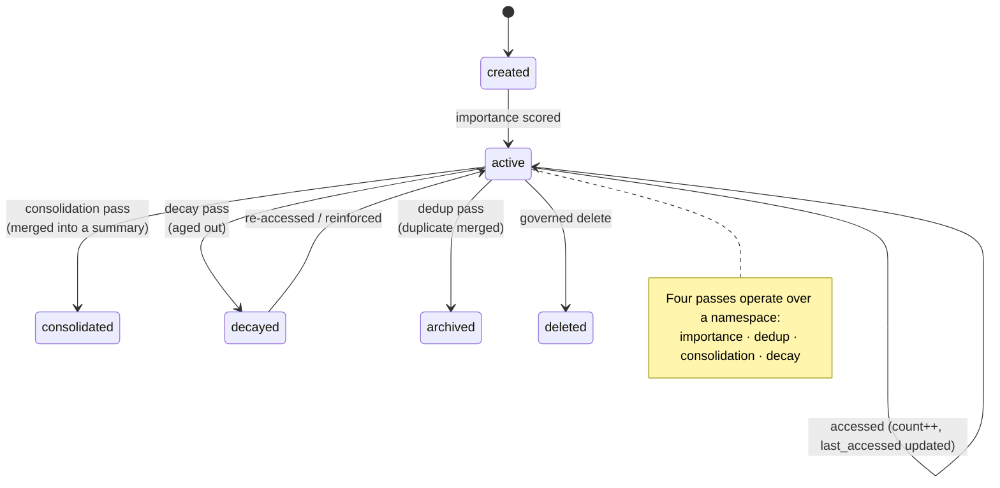
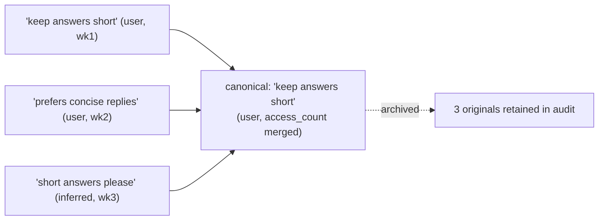

# Memory Has a Lifecycle: Importance, Dedup, Consolidation, Decay

A vector store grows in one direction: up. Every memory you write stays exactly as written,
forever, at full weight. Run an agent for a month and you've got fifteen near-identical
"user prefers concise answers" notes, a pile of last-week's events that no longer matter, and
a retrieval quality curve bending toward noise. The store has no notion that memory should be
*curated*.

Human memory isn't like that. We forget the unimportant, merge repeats into gist, summarize
episodes into "that trip to Goa," and let yesterday's lunch fade while keeping our home
timezone indefinitely. That curation isn't a bug in human memory — it's the feature that keeps
it useful. This post builds the same thing for an agent: a **memory lifecycle** of four
managed passes. It's part 4 of a series on a trust-aware memory layer.

## The lifecycle at a glance



These are **passes**, not hot-path operations — maintenance jobs that run over a namespace,
return a summary of what changed, and emit audit events. They're the difference between a
memory *store* and a memory *system*.

## 1. Importance: not all memories are equal

When a memory is created, the engine scores its **importance** (0–1) — a cheap signal that
later feeds ranking (it's one of the fusion dimensions from
[Post 3](03-explainable-hybrid-retrieval.md)). Importance combines things like provenance,
type, and signals in the content. A user-stated career goal scores higher than a system note
about a default setting.

Importance also *evolves*: each time a memory is retrieved, its `access_count` and
`last_accessed_at` update. Frequently-used memories are, empirically, more important — so
access reinforces them, the same way recalling something makes you more likely to recall it
again.

```python
# retrieval "touches" what it returns — reinforcement is a side effect of use
def on_retrieved(memory):
    memory.access_count += 1
    memory.last_accessed_at = now()
```

## 2. Deduplication: merge the near-identical

Agents repeat themselves. The user says "keep answers short" in three different sessions and
you get three memories that are 95% the same. Dedup finds these — same type, high content
similarity — and **merges** them: one canonical memory survives, the duplicates are archived
(not deleted — their audit trail persists), and the survivor inherits the strongest
provenance and the combined access history.



Crucially, dedup *raises trust* the right way: three independent statements of the same
preference are **corroboration** (Post 2), so the merged memory is more confident than any
single one — while the store gets smaller, not bigger.

## 3. Consolidation: summarize episodes into gist

Dedup merges *duplicates*. Consolidation merges *related* memories into a higher-level
**summary** — and this is where provenance gets interesting. Take two memories:

- `"User wants to become a staff engineer within 2 years"` (preference, user)
- `"User dislikes long meetings"` (preference, inferred)

Consolidation can produce:

- `"User is pursuing a staff-engineer role and prefers short, focused meetings"`
  — type `summary`, provenance `consolidation` (quality **0.75**), with
  **`derived_from: [career_goal_id, meetings_id]`**.

That `derived_from` link is the audit trail of *reasoning*: the summary isn't a free-floating
claim, it's traceable to its sources. And its provenance is deliberately `consolidation`
(0.75), not `user` (1.0) — a summary the system inferred should carry *less* authority than
what the user directly said, even when it's accurate. The trust model and the lifecycle
reinforce each other here.

```json
{
  "type": "summary",
  "content": "User is pursuing a staff-engineer role and prefers short, focused meetings",
  "provenance": { "source": "consolidation", "derived_from": ["mem_…goal", "mem_…meetings"] }
}
```

## 4. Decay: let the unimportant fade

Finally, decay. We met type-aware freshness in [Post 2](02-trust-as-a-first-class-signal.md)
as a *trust* factor; the decay *pass* acts on it. Memories whose freshness has fallen below a
threshold — old events, mostly — transition to a `decayed` state: they drop out of default
retrieval but aren't destroyed, and a later access can **reinforce** them back to active.

```python
_HALF_LIFE_DAYS = {"event": 14, "preference": 180, "fact": 365, "summary": 120}

def should_decay(memory, threshold=0.1) -> bool:
    half_life = _HALF_LIFE_DAYS.get(memory.type, 180)
    freshness = 0.5 ** (age_days(memory) / half_life)
    return freshness < threshold and memory.access_count == 0
```

The type-awareness is the whole trick: a 60-day-old event is long gone (`freshness ≈ 0.05`),
a 60-day-old fact is barely touched (`≈ 0.89`). Decay isn't "delete old stuff" — it's "let
each *kind* of memory age at its natural rate."

## Why these are passes, not triggers

A reasonable objection: why not dedup on every write, decay on every read? Because making the
hot path do curation work makes it slow and non-deterministic, and because good curation often
needs to see the *whole* namespace at once (you can't dedup against memories you haven't
compared). Running them as explicit passes — invokable on a schedule or on demand — keeps
writes and reads fast and makes each pass independently testable and auditable:

```bash
curl -X POST localhost:8000/v1/intelligence/dedup        -d '{"namespace":"user:1"}'
curl -X POST localhost:8000/v1/intelligence/consolidate  -d '{"namespace":"user:1"}'
curl -X POST localhost:8000/v1/intelligence/decay        -d '{"namespace":"user:1"}'
```

Each returns a summary of what changed (`{"merged": 3, "archived_ids": [...]}`) and every
transition emits an append-only audit event — so you can always answer "when did this memory
get consolidated, and from what?" (governance is [Post 7](07-governing-agent-memory.md)).

## See it run

```bash
python -m scp_memory &
python examples/intelligence_quickstart.py   # creates memories, runs the passes, prints deltas
```

Watch duplicates collapse, a summary appear with its `derived_from`, and old events decay —
then retrieve and see the store stay relevant instead of bloating.

## The honest caveats

- **Consolidation summarization is only as good as its summarizer.** In the hermetic default,
  consolidation uses simple heuristics; a production deployment would plug in an LLM for the
  actual summarization step. The *structure* — `derived_from`, the 0.75 provenance, the audit
  — is what's durable; the text-generation quality is a swappable dependency.
- **Aggressive decay can hide things users still want.** Thresholds are policy. We default to
  conservative decay (only zero-access, well-past-half-life memories) and keep decayed
  memories recoverable rather than deleted. Tune for your tolerance.
- **Passes need scheduling.** These don't run themselves. In production you'd trigger them on a
  cadence (nightly) or by namespace activity. The engine gives you the operations; the
  orchestration is yours.

## Why this matters for the whole layer

The lifecycle is what keeps the *other* posts true over time. Explainable retrieval (Post 3)
degrades if the store fills with stale near-duplicates. Trust (Post 2) is sharper when
corroboration has been consolidated and contradictions resolved. A memory layer without a
lifecycle is a memory layer with a half-life — it works in the demo and rots in production.
Curation is not a nice-to-have; it's what makes long-lived memory *stay* useful.

## Next

We keep claiming the trust model should improve over time — swap the lexical contradiction
detector for a real NLI model, plug in better embeddings. But "improve" is a claim you have to
*prove*. Next post: why a smarter model can make your trust scores *worse*, and the
calibration gate that stops it from shipping.

➡️ [Post 5: Calibrate Before You Sophisticate](05-calibrate-before-you-sophisticate.md)

Lifecycle services live in [`services/`](https://github.com/your/scp-memory-core) —
`importance_service`, `dedup_service`, `consolidation_service`, `decay_service`. ⭐ if "memory
that curates itself" is what your agents have been missing.
