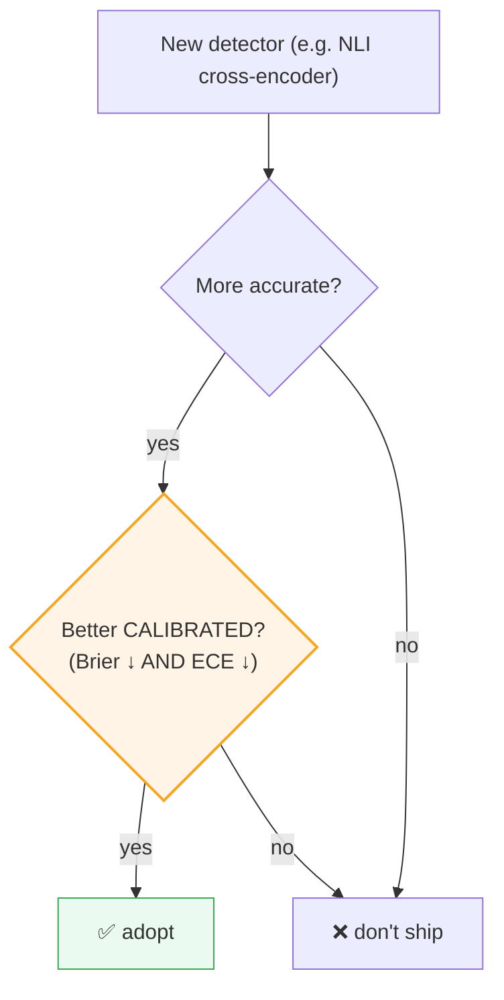

# Calibrate Before You Sophisticate: Gating Model Swaps with Brier & ECE

In [Post 2](02-trust-as-a-first-class-signal.md) I admitted the weak spot in the trust model:
corroboration and contradiction detection use a *lexical* heuristic. It checks whether two
same-type memories share tokens and whether one negates the other. It correctly catches
"prefers dark mode" vs "no longer wants dark mode." It completely misses "user lives in
Berlin" vs "user lives in Munich" — no shared tokens, no negation, but a flat contradiction.

The obvious fix: swap the heuristic for a real **NLI** (natural language inference) model — a
cross-encoder that actually understands entailment and contradiction. It's smarter. It'll
catch Berlin-vs-Munich. Ship it, right?

**Not so fast.** This post is about why "it's smarter" is not a sufficient reason to ship a
model into a trust system — and the calibration gate that forces the upgrade to *prove* it
helps. This is the most important methodological idea in the whole series, and it generalizes
far beyond memory.

## The trap: accuracy is not calibration

A trust score is a *probability-like* statement: "I'm 0.8 confident this memory is reliable."
For that number to be useful, it has to mean what it says — when the system says 0.8, it
should be right about 80% of the time. That property is **calibration**, and it is *different
from accuracy.*

Here's the trap. A more sophisticated model can be more *accurate* (it gets more
contradictions right) while being *worse calibrated* (its confidence numbers are
systematically off — it says 0.95 when it should say 0.7). For a trust layer, calibration is
the thing that matters, because downstream code and humans *act on the number*. A confidently
wrong trust score is worse than a humbly uncertain one.



The gate isn't "is it smarter?" It's "does it make the *numbers more honest?*"

## Measuring calibration: Brier and ECE

Two metrics, both lower-is-better, both computed over a fixed labelled set (memories with
ground-truth "reliable / not" labels and a known contradiction pair or two):

**Brier score** — mean squared error between predicted confidence and outcome:

```python
def brier(predictions: list[float], outcomes: list[int]) -> float:
    # outcomes are 0/1; predictions are confidences in [0,1]
    return sum((p - o) ** 2 for p, o in zip(predictions, outcomes)) / len(predictions)
```

A model that says 0.9 and is right contributes `(0.9-1)² = 0.01`. One that says 0.9 and is
*wrong* contributes `(0.9-0)² = 0.81`. Brier punishes confident mistakes hard — exactly the
behavior we want to detect in a trust system.

**Expected Calibration Error (ECE)** — bucket predictions by confidence, and in each bucket
compare the average confidence to the actual accuracy; ECE is the (weighted) average gap:

```python
def ece(predictions, outcomes, n_bins=10) -> float:
    total, error = len(predictions), 0.0
    for b in range(n_bins):
        lo, hi = b / n_bins, (b + 1) / n_bins
        idx = [i for i, p in enumerate(predictions) if lo < p <= hi]
        if not idx:
            continue
        avg_conf = sum(predictions[i] for i in idx) / len(idx)
        accuracy = sum(outcomes[i] for i in idx) / len(idx)
        error += (len(idx) / total) * abs(avg_conf - accuracy)
    return error
```

ECE answers the plain-English question: *"when this thing says 0.8, how often is it actually
right?"* If the answer is "60% of the time," ECE is high and the confidence is lying.

## What the harness actually found

Running the calibration harness on the hermetic lexical detector over the fixed set:

- **Brier ≈ 0.17**, **ECE ≈ 0.19**.
- The dominant error: **over-confidence on semantic contradictions** it can't read lexically.
  On the Berlin/Munich-style pairs, it sees no token overlap, declares "no contradiction,"
  and reports *high* confidence in a memory that's actually contradicted. Confidently wrong —
  the worst quadrant.

So the lexical detector has a *known, measured* failure mode. NLI should fix the underlying
errors. But the gate doesn't ask whether NLI fixes errors — it asks whether NLI ships a
**lower ECE**. Until that's measured on the same set, NLI stays *opt-in* (behind a flag,
`SCP_TRUST_NLI`) and the lexical detector stays the default.

```python
# the swap is gated, not assumed
if new_ece < baseline_ece:        # and Brier didn't regress
    adopt(nli_detector)
else:
    keep(lexical_detector)        # "smarter" lost on the metric that matters
```

## Why this is a Principal-level decision, not a tuning detail

It would have been easy — and impressive-sounding — to write "now powered by NLI!" in the
README. The discipline is in *not* doing that until the number that governs user trust
actually improves. Three things make this matter:

1. **It optimizes the right objective.** The user doesn't care whether the detector is a
   cross-encoder or a regex. They care whether the confidence number is honest. The gate keeps
   the team pointed at *that*.
2. **It's reusable.** This isn't a one-off for NLI. *Any* future detector, embedder, or trust
   tweak passes the same gate. The harness is infrastructure — `evals/run_trust_calibration.py`
   in the repo — and the gate is a policy that outlives any single model.
3. **It's honest in public.** The benchmark report states the lexical numbers *and* their
   failure mode plainly, and marks the NLI result as "not yet run through the harness." A
   trust system that hides its own calibration would be self-refuting.

## The general principle

> **Calibrate before you sophisticate.** A more sophisticated component earns its place by
> improving the metric your users actually depend on — not by being more sophisticated.

This applies far past trust scores. Swapping a retrieval model? Gate it on nDCG, not on the
model's reputation. Swapping a ranker? Gate it on your eval set's MRR. The instinct to adopt
the fancier thing because it's fancier is how systems accumulate complexity without
accumulating value. A gate — a fixed dataset, a metric, a threshold, a CI job — is the
antidote.

## See it run

```bash
pip install -e .
python evals/run_trust_calibration.py            # prints Brier / ECE for the default detector

# the challenger (needs the embeddings extra):
pip install -e ".[embeddings]"
SCP_TRUST_NLI=1 python evals/run_trust_calibration.py
# adopt NLI only if ECE drops and Brier doesn't regress
```

Same dataset, same metrics, head-to-head. The decision makes itself.

## The honest caveats

- **The eval set is small and fixed.** These numbers are *directional*, not a leaderboard
  claim — which is exactly why the report says so. A bigger, domain-specific labelled set
  makes the gate sharper; building one is the highest-value next step.
- **Calibration can be improved without changing the model** (temperature scaling, isotonic
  regression). Sometimes the right move isn't a smarter detector but a *recalibrated* one. The
  gate is agnostic to how you lower ECE — it only cares that you did.
- **A gate is only as good as its labels.** Garbage ground truth → a confident-looking gate
  that means nothing. Invest in the labelled set like you'd invest in tests, because that's
  what it is.

## Next

We keep saying "the default is a hermetic stand-in; the real thing is opt-in." That phrase has
done a lot of work in this series. Next post: the architecture that makes it true — backend
seams that let one codebase run offline-on-a-laptop *and* scale on a cluster, with the API
contract unchanged.

➡️ [Post 6: Hermetic by Default, Pluggable at Scale](06-hermetic-by-default-pluggable-at-scale.md)

The harness is [`evals/run_trust_calibration.py`](https://github.com/your/scp-memory-core).
⭐ if "prove it lowers ECE before you ship it" is a discipline you wish more ML systems had.
