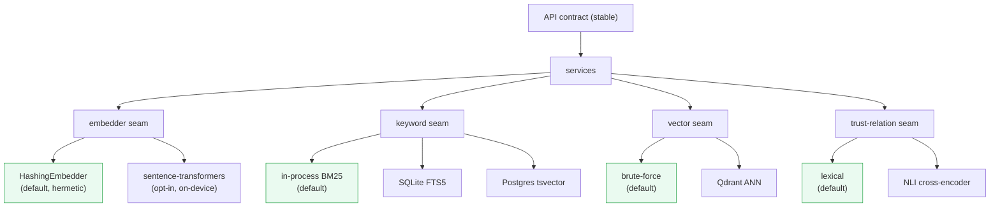
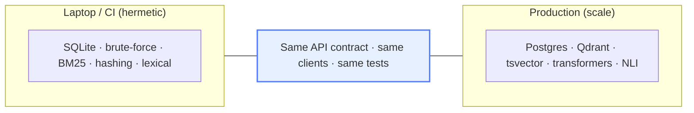

# Hermetic by Default, Pluggable at Scale: Backend Seams Done Right

Throughout this series I've leaned on one phrase: *"the default is a hermetic stand-in; the
real thing is opt-in."* The hermetic default is why you can clone the repo and run
`python seed/seed_golden_examples.py` in 60 seconds with no GPU, no Docker, no API keys — and
why CI is deterministic. The opt-in path is why the same code can run real semantic embeddings,
Qdrant ANN, Postgres full-text search, and an NLI trust detector in production.

This post is about the architecture that makes *both* true at once: **backend seams.** It's
the least flashy idea in the series and arguably the most important for anything that wants to
be infrastructure rather than a demo.

## The tension

Two design goals pull in opposite directions:

- **Adoption wants zero friction.** If running the project requires standing up Postgres,
  Qdrant, and downloading a 2 GB model, most people bounce before they see the value. The first
  experience has to be one command, offline.
- **Production wants real components.** Brute-force vector scan over SQLite is fine for a demo
  and hopeless at a million memories. Real deployments need ANN, an inverted index, a real DB.

The wrong resolutions are: (a) ship the heavy stack as default and lose the casual cloner, or
(b) ship two codebases (a "demo" and a "real" one) that drift apart. The right resolution is
**one codebase, one contract, swappable backends behind seams.**



Green = the hermetic default. Everything to its right is the same seam with a heavier
implementation. The services above the seams *don't know or care* which implementation is
loaded.

## What a seam actually is

A seam is three things: an **interface**, two or more **implementations**, and a **factory**
that picks one from config. Concretely, the embedder seam:

```python
# the interface — what services depend on
class Embedder(Protocol):
    def embed(self, text: str) -> list[float]: ...

# default implementation: deterministic, offline, zero-dependency
class HashingEmbedder:
    def embed(self, text: str) -> list[float]:
        # hash tokens into a fixed-width vector — not semantic, but pure and instant
        ...

# opt-in implementation: real semantics, needs the [embeddings] extra
class LocalEmbedder:
    def embed(self, text: str) -> list[float]:
        return self._model.encode(text).tolist()

# the factory: env var decides, services stay oblivious
def make_embedder() -> Embedder:
    if os.getenv("SCP_EMBEDDER") == "sentence-transformers":
        return LocalEmbedder()          # fails loud if the extra isn't installed
    return HashingEmbedder()            # hermetic default
```

The rest of the engine calls `embedder.embed(text)` and never branches on which one it is.
Swapping is a single environment variable:

```bash
SCP_EMBEDDER=sentence-transformers   # real semantics
SCP_VECTOR_BACKEND=qdrant            # ANN at scale
SCP_KEYWORD_BACKEND=fts5             # or tsvector
SCP_TRUST_NLI=1                      # NLI contradiction detection (gated — see Post 5)
```

## The rule that makes it work: the contract never moves

Here's the discipline that turns "we have some config flags" into "we have real seams": **the
API response shape is identical regardless of which backend is loaded.** A retrieval result
from the brute-force vector backend and from Qdrant have the same fields, the same `signals`,
the same `trust` block. The trust response is the same whether the lexical or NLI detector
produced it (this was a hard requirement — it's why
[Post 2](02-trust-as-a-first-class-signal.md)'s explanation is generated from the decomposition,
not from the detector's internals).

Why this matters: the **clients** — two SDKs, an admin console, an Android app — are written
against the contract, not the implementation. When you flip `SCP_VECTOR_BACKEND=qdrant` in
production, *not one line of client code changes.* The seam is invisible above the API. That's
the payoff: portability without a rewrite, and a demo that's the same software as production.



## Testing across the seam

Seams pay off enormously in tests. The default path is hermetic, so **the whole suite (132
tests) runs offline, deterministically, with no services** — `pytest` just works on a fresh
clone. The scale backends get their own **gated** tests: a CI job spins up Postgres and Qdrant
and runs the integration suite against them, while locally those tests *skip* (no services
present) instead of failing.

```python
@pytest.mark.qdrant      # skipped unless SCP_TEST_QDRANT_URL is set
def test_qdrant_backend_roundtrip(): ...
```

So you get both: a fast inner loop everyone can run, and real coverage of the production
backends in CI. The seam is the thing that lets those two coexist without forking the tests.

## "Fail loud" beats "fail weird"

One subtle but important choice: when you ask for a backend whose dependency isn't installed,
the factory **fails immediately with a clear message** ("you set `SCP_EMBEDDER=sentence-
transformers` but the `[embeddings]` extra isn't installed"), rather than silently falling back
to the default. Silent fallback is how you end up running a hashing embedder in production for
three weeks wondering why retrieval quality is mediocre. Explicit beats implicit, loudly.

## See it run

```bash
# hermetic default — nothing extra
python -m scp_memory

# flip on real embeddings (after installing the extra)
pip install -e ".[embeddings]"
SCP_EMBEDDER=sentence-transformers python -m scp_memory
# same API, same clients, better vectors
```

Hit the same `/v1/retrieval/search` endpoint both ways. The response shape is byte-for-byte
the same structure; only the `vector` signal's quality changes.

## The honest caveats

- **Seams aren't free.** Each one is an interface, ≥2 implementations, a factory, and gated
  tests. Don't seam *everything* — seam the things that genuinely have a "laptop vs cluster"
  split (storage, embeddings, search, the trust detector). Over-seaming is just speculative
  abstraction wearing a nice coat.
- **The default's quality is a stand-in, and you must say so.** The biggest risk of a great
  hermetic default is that someone mistakes it for the ceiling. Every doc here is explicit:
  hashing embeddings and lexical trust are *demo-grade*; real quality is one env var away.
- **Config sprawl is real.** Four `SCP_*` backend switches is manageable; forty would not be.
  Keep the seam count small and the defaults sane so the zero-config path stays the good path.

## Why this is the quiet backbone of the whole project

Every other post in this series depends on this one. The explainability contract (Post 3) is
stable *because* the seam rule forbids the contract from moving when backends change. The
calibration gate (Post 5) can keep the lexical detector as default and offer NLI as opt-in
*because* the trust-relation seam exists. The 60-second demo that hooks new users *is* the
hermetic default. Backend seams are how a project gets to be both approachable and serious —
which is the definition of infrastructure.

## Next

We've built a trust-aware, explainable, self-curating, scalable memory layer. One thing
stands between it and a real user's data: **governance.** Last post — namespacing, append-only
audit, and the right to be forgotten.

➡️ [Post 7: Governing Agent Memory](07-governing-agent-memory.md)

The seams live across [`retrieval/`, `services/`, and `trust/`](https://github.com/your/scp-memory-core)
(`embedder_factory.py`, `keyword_backend.py`, the vector backends, `relation_detector.py`).
⭐ if "one codebase, laptop to cluster, contract unchanged" is the architecture you keep
reaching for.
