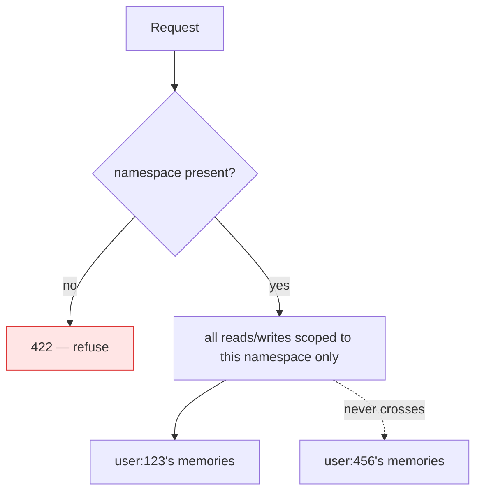
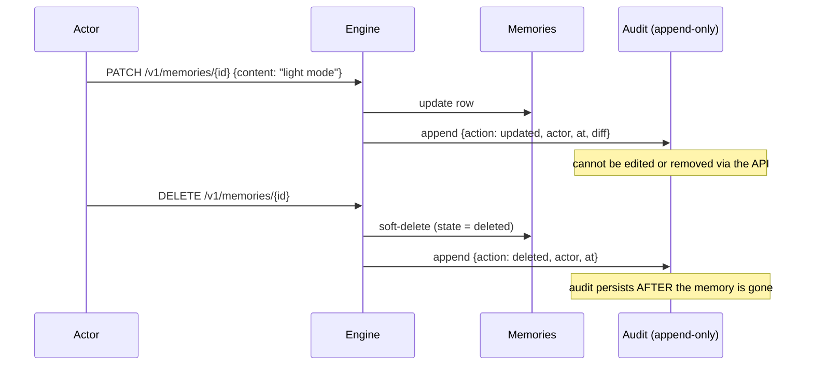

# Governing Agent Memory: Namespacing, Audit, and the Right to Be Forgotten

We've built a memory layer that's trustworthy ([Post 2](02-trust-as-a-first-class-signal.md)),
explainable ([Post 3](03-explainable-hybrid-retrieval.md)), self-curating
([Post 4](04-memory-lifecycle.md)), measured ([Post 5](05-calibrate-before-you-sophisticate.md)),
and scalable ([Post 6](06-hermetic-by-default-pluggable-at-scale.md)). It works beautifully in
a demo with one fake user.

Then you point it at production, where there are ten thousand real users, a compliance team,
and a regulation that says a person can demand you delete everything you know about them. Now
"just store the memories" is not an architecture — it's an incident waiting to happen. This
final post is about **governance**: the three properties that turn a clever memory engine into
something you can actually ship into a product that touches real people's data.

These aren't enterprise garnish. They're the difference between a side project and
infrastructure.

## 1. Namespacing: every memory belongs to someone

The first rule: **there is no global memory.** Every memory is scoped to a **namespace** — a
tenant, a user, an organization — and the namespace is *required* on every operation. It's not
inferred, not defaulted, not optional.

```python
class MemoryCreate(BaseModel):
    content: str
    namespace: str = Field(min_length=1)   # required — the scope is never implicit
    type: MemoryType = MemoryType.fact
    ...
```

Retrieval is the same — you cannot search without saying *whose* memory you're searching:

```bash
# this is a validation error — no namespace, no query
curl -X POST localhost:8000/v1/retrieval/search -d '{"query":"anything"}'    # 422

# correct: scope is mandatory
curl -X POST localhost:8000/v1/retrieval/search \
  -d '{"query":"what theme?","namespace":"user:123"}'
```



Why make it *mandatory* rather than "available"? Because the failure mode of optional scoping
is catastrophic and silent: one forgotten filter and user A's agent retrieves user B's private
memories. Making the namespace a required field turns a potential data-leak into a
*validation error at the boundary* — the system refuses to do the dangerous thing rather than
trusting every caller to remember. This is "secure by construction," and it's cheap.

## 2. Append-only audit: what did the agent know, and when?

Every mutation — create, update, consolidate, decay, delete — emits an **immutable audit
event**: who did it (actor), what happened (action), when (timestamp), and the diff.

```json
{ "id": "evt_…", "action": "updated", "actor": "user:123",
  "at": "2026-06-12T09:30:00Z", "diff": { "content": ["dark mode", "light mode"] } }
```

Two properties make this governance rather than logging:

- **Append-only.** You can't edit or delete an audit event through the API. History is
  tamper-evident by construction. The store records what happened; it doesn't let you rewrite
  what happened.
- **It survives deletion.** When a memory is deleted, its audit trail *remains*. This sounds
  paradoxical until you need it: "prove you deleted user X's data on date Y" is answerable
  *only* if the deletion itself left a durable record.



This is what lets you answer "when did the agent learn this?", "who changed it?", and "what did
it know at the time it made that decision?" — the questions that come up the first time an
agent's memory is involved in something consequential.

## 3. Governed delete: the right to be forgotten, done correctly

"Delete this memory" has two legitimate meanings, and a real system needs both:

- **Soft delete (default):** mark the memory `deleted`. It vanishes from retrieval immediately
  — the agent stops seeing it — but the row and its audit survive. This is the common case:
  the user retracts something, you stop using it, but you keep the record that it existed and
  was removed.
- **Hard delete (compliance):** physically erase the memory's content for a real
  right-to-be-forgotten request — *while retaining the audit event that the deletion
  happened.* You destroy the data; you keep the proof you destroyed it.

```bash
DELETE /v1/memories/{id}              # soft — gone from retrieval, recoverable, audited
DELETE /v1/memories/{id}?hard=true    # hard — content erased; audit of the deletion remains
```

The default being *soft* is deliberate: destructive operations should be opt-in, not the path
of least resistance. You have to explicitly ask for irreversible erasure. Most "deletes" in a
memory system are really "stop believing this," and soft delete models that exactly — including
the ability to recover from a mistaken deletion.

## Governance and trust reinforce each other

Notice how the governance layer and the trust layer interlock. Provenance (Post 2) is *who
said it*; audit is *when and how it changed*. Together they answer the full chain of custody
for any memory: it came from the user on this date, was corroborated then, contradicted later,
consolidated into a summary, and finally retracted — every step recorded, every trust input
traceable. A memory layer with trust but no audit can tell you *how much to believe* a memory
but not *how it got that way*. You need both to ship into anything regulated.

## See it run

```bash
python -m scp_memory &
python seed/seed_golden_examples.py
# update one, then read its history:
curl localhost:8000/v1/memories/<id>/audit          # full append-only trail
# soft-delete and confirm it leaves retrieval but keeps its audit:
curl -X DELETE localhost:8000/v1/memories/<id> -H 'X-Actor: me'
curl localhost:8000/v1/memories/<id>/audit          # delete event is recorded
```

The Android reference app and the admin console both surface this trail in the UI — because
"show me the history of this memory" is a feature users and auditors actually ask for.

## The honest caveats

- **Namespacing is isolation, not authentication.** The engine guarantees that operations are
  *scoped* to a namespace; it does **not** verify that the caller is allowed to use that
  namespace. AuthN/AuthZ live at the deployment boundary (a reverse proxy / API gateway / SSO /
  mTLS), by design — the engine trusts an authenticated namespace the way a database trusts a
  connected user. Don't expose it raw to the internet.
- **Audit grows. Plan retention.** Append-only means the audit table only gets bigger. For high
  write volume you'll want partitioning and a retention policy (which itself must be auditable).
  The engine gives you the trail; operating it at scale is a real, separate job.
- **Hard delete and "derived" data.** If a deleted memory was *consolidated* into a summary
  (Post 4), erasing the source raises a question about the derivative. The `derived_from` links
  make this *detectable*; the policy (re-consolidate? redact the summary?) is a deployment
  decision the links enable but don't dictate.

## The series, in one sentence

Across seven posts we built the argument that **memory is infrastructure** — and then built
the thing: a layer that knows *who said it* (provenance), *why a result surfaced*
(explainable retrieval), *how to stay relevant over time* (lifecycle), *whether its own
confidence is honest* (calibration), *how to run anywhere* (seams), and *how to be
accountable for real users' data* (governance). None of those is a vector-index feature. All
of them are what a long-lived agent actually needs.

## Try the whole thing

```bash
git clone https://github.com/your/scp-memory-core && cd scp-memory-core
pip install -e ".[dev]"
python -m scp_memory &
python seed/seed_golden_examples.py
```

Ten memories, each demonstrating one capability from this series — a contradiction, a
consolidation, an inferred-vs-stated trust gap, event decay, governed audit. Query them, read
the explanations, inspect the trust, follow the audit trail.

If "memory your agent — and your auditor — can trust" is the layer your stack has been
missing, **⭐ the repo**, run the demo, and tell me what breaks. The category is young; the
best version of this gets built in the open.

⬅️ Back to [Post 1: Why AI Agents Need a Memory Layer](01-why-agents-need-a-memory-layer.md) ·
📚 [The full series](README.md)
