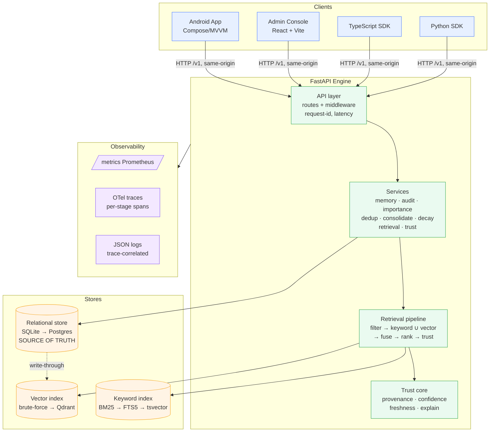
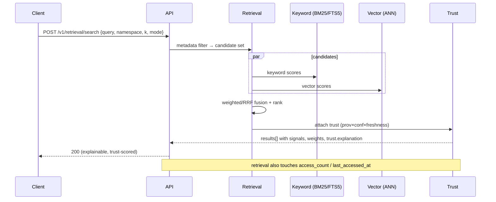

# 05 — Architecture Document

> **Artifact 2 of the 80/20 set.** The system of record a Staff/Principal reviewer asks
> for. Authoritative engineering summary; cross-references the memory bank for depth.

---

## System overview

SCP Memory Engine is a **trust-aware, explainable memory layer** exposed as a versioned
HTTP API (`/v1`) with two SDKs (Python, TypeScript), an admin console, and an Android
reference client. The relational store is the **source of truth**; the vector store is a
derived index. Every mutation emits an **append-only audit event**. Every retrieval result
carries **per-signal scores** and a **decomposable trust breakdown**.

Design tenets: **pure core, hermetic defaults, pluggable scale paths, contract stability.**
The default path runs offline with no GPU and no external services (SQLite + brute-force
vectors + in-process BM25 + lexical trust), so CI and a first-time clone are one command.
Production scale paths (Postgres, Qdrant, FTS5/tsvector, NLI) sit behind seams selected by
environment variables — **without changing the API contract.**

## Architecture diagram (component view)

## Core components

| Component | Responsibility | Key property |
|---|---|---|
| **API layer** (`api/`) | FastAPI routes, request-id + latency middleware | Thin; no business logic |
| **Models** (`models/`) | `Memory`, `Provenance`, `AuditEvent`, `MemoryRelation`, enums | Pydantic v2; pure |
| **Intelligence** (`intelligence/`, services) | Importance scoring, dedup, consolidation, decay | Lifecycle passes, not hot path |
| **Retrieval** (`retrieval/`) | Embedding, keyword (BM25), fusion (weighted/RRF) | All pure, I/O-free, testable |
| **Trust** (`trust/`) | Provenance, freshness, confidence, score, explain | Decomposable, no black box |
| **Services** (`services/`) | Orchestration + persistence + backend seams | DB-aware; trust core stays pure |
| **Observability** (`observability/`) | Tracing config, per-stage spans | Opt-in, no-op-safe |
| **SDKs / Console / Android** | Clients over the §29 contract | Reuse the contract; no engine logic |

## Key data path — hybrid retrieval

## Trust scoring (decomposable)

- **provenance_quality** ← source map: `user` 1.0 → `consolidation` 0.75 → `inferred` 0.5
  → `system` 0.4 (unknown 0.5).
- **confidence** = provenance floor, raised toward 1.0 by corroboration (saturating),
  reduced a fixed penalty per contradiction.
- **freshness** = type-aware exponential decay (`event` ~14d half-life ≪ `preference`
  ~180d).
- Corroboration/contradiction are **lexical stand-ins** today, swappable for an **NLI
  cross-encoder** behind the same contract — *the response shape never changes.*

## Tradeoffs (and why)

| Decision | Chose | Gave up | Why |
|---|---|---|---|
| Source of truth | Relational | Vector-store-as-primary | Correctness + audit + governed delete; vector is rebuildable |
| Default vectors | Brute-force | ANN everywhere | Hermetic, zero-dependency CI; ANN is opt-in at scale |
| Default embeddings | Hashing | Real model default | Offline determinism; real model behind `[embeddings]` extra |
| Trust detection | Lexical default | NLI default | No GPU in CI; NLI gated on a calibration win |
| Fusion | Weighted default | RRF default | Benchmarked better on eval set (nDCG 1.00 vs 0.69); RRF a knob |
| Explainability | Always-on contract | Optional/computed | "Why" must never be a second query |

## Scaling strategy

- **Reads/retrieval:** bounded `k`; vector to **Qdrant** (ANN); keyword to **FTS5**
  (single-node) or **Postgres tsvector** (multi-node) — all behind `SCP_KEYWORD_BACKEND`
  / vector-backend seams.
- **Writes:** relational write-through with vector reconciliation; intelligence passes run
  as background/operator jobs, off the request hot path.
- **Statelessness:** the engine is stateless between requests; horizontal scale-out behind
  the proxy; stores scale independently.

## Reliability strategy

- **/health** (liveness) + **/health/ready** (DB/deps) for orchestrators.
- **Prometheus** counters + request-latency histogram → **p50/p95/p99 SLOs**;
  **Alertmanager** severity routing (page/ticket) with engine-down inhibition.
- **Append-only audit** as the correctness backstop; relational store is recoverable truth,
  vector index is rebuildable.
- **Opt-in OTel** with per-stage retrieval spans (candidates/vector/keyword/trust/fuse) for
  latency attribution.
- **Calibration harness** prevents trust regressions from shipping.

## Deployment modes

1. **Local / hermetic** — SQLite + brute-force + BM25 + lexical trust. One command, no
   network. (Default; CI; demos.)
2. **Cloud / scale** — Postgres + Qdrant + tsvector + opt-in NLI + full observability
   stack (Docker Compose: app + OTel collector + Tempo + Prometheus + Grafana).
3. **On-device (Android)** — hybrid client: thin HTTP client when the engine is reachable;
   else a local Room store + on-device retrieval/trust **stand-in mirroring the contract**
   (no engine math duplicated on the live path).

## References

Full depth in the memory bank: [`../project-memory-bank/03-system-architecture.md`],
[`../project-memory-bank/13-retrieval-model.md`], [`../project-memory-bank/15-trust-model.md`],
[`../project-memory-bank/17-observability-model.md`], API contract
[`../project-memory-bank/29-api-contracts.md`].
